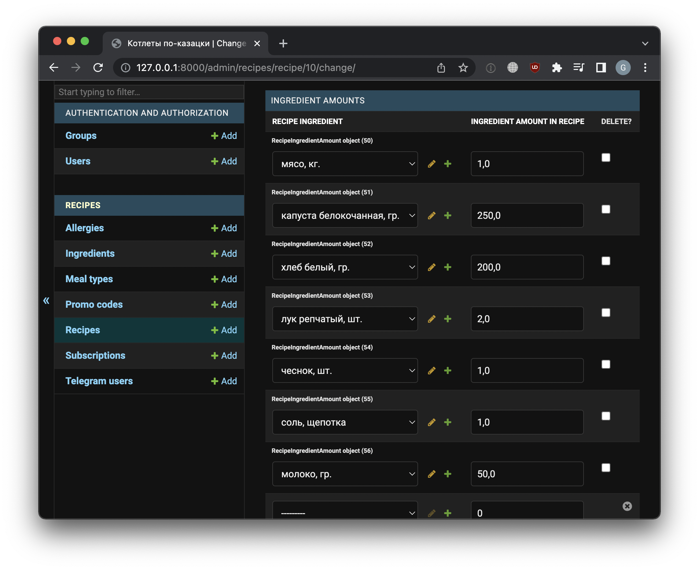

# FoodPlan Service

This project helps with `Telegram bot` and `Django` powered backend creation for food recipes delivery.
It maintains users, their paid subscriptions, food recipes, ingredients and many more.
You can install and run it on your local machine or use preconfigured [Heroku app](https://dvmn-recipes.herokuapp.com/admin)
Or use [this](https://t.me/dvmn_march_11_bot) Telegram bot.




## Installation
1. Clone project
```bash
git clone https://github.com/gennadis/dvmn-recipes.git
cd dvmn_recipes
```

2. Create virtual environment
```bash
python3 -m venv venv
source venv/bin/activate
```

3. Install requirements
```bash
pip install -r requirements.txt
```

4. Rename `.env.example` to `.env` and fill your secrets in it.  
```bash
SECRET_KEY = "django-secret-key"
DEBUG = False
BOT_TOKEN = "telegram_bot_token"
PAYMENT_TOKEN = "SBER token"
```

5. Migrate
```bash
python manage.py migrate
```

6. Create Django superuser
```bash
python manage.py createsuperuser
```

7. Use preconfigured fixtures to populate the database with recipes, ingredients, subscription plans, etc.
```bash
python manage.py loaddata dump.json
```

8. Run gunicorn web server
```bash
gunicorn dvmn_recipes.wsgi
```

9. Run telegram bot
```bash
python manage.py start_bot
```

# Usage
1. Open `Recipes` app admin panel in browser [http://127.0.0.1:8000/admin/](http://127.0.0.1:8000/admin/)

2. Start using bot by typing `/start` command

# About Bot
1. if bot was restarted, send any message and bot will restart your interface.  

2. if you find any error and bot doesn't respond to you, send '/main'.  
This command forcibly terminates any processes and redirects to the main menu.  

3. Even if you cleared data in your phone, when you sign in bot with the same phone number, 
it finds you out and you'll be able to see all your subscriptions.

4. Bot tested with Sber payment service.  
You can try to change token to any service, but perhaps you will need python-developer help.
